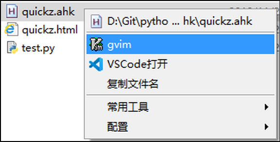

.. _topics-index:

.. QuickZ documentation master file, created by
   sphinx-quickstart on Fri Nov 29 16:38:59 2019.
   You can adapt this file completely to your liking, but it should at least
   contain the root `toctree` directive.

QuickZ 介绍
===========

QuickZ 是由 Autohotkey 编写的快速热键与菜单工具

QuickZ 包含两个核心模块： 

1.VIMD热键

vimd模块的核心功能是利用 autohotkey 的热键绑定功能，为指定应用程序绑定一套仿 vim 化的热键体系。

类似于  `vimperator for firefox <http://vimperator.org/>`_ / cVim for chrome

目标是在使用应用程序的时候可以尽可能地键盘来操作。

2.MenuZ快速菜单

menuz模块的灵感来源于万年书妖的 candy，基本操作是获取当前的环境，包括选中的文本、文件、所有的窗口信息

根据获取的内容来显示针对性的菜单，实现快捷操作。

显示的菜单如图：

.. toctree::
   :caption: VIMD 热键
   :hidden:

   vimd

.. toctree::
   :caption: MenuZ 菜单
   :maxdepth: 2
   :hidden:

   menuz

.. toctree::
   :caption: API
   :maxdepth: 2
   :hidden:

   api/class_menuz
   api/class_vimd