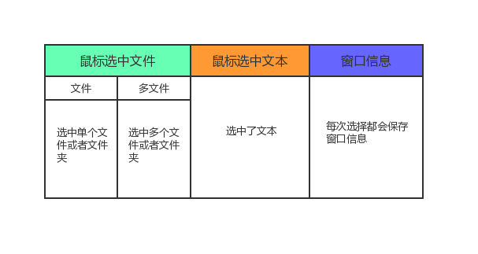
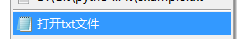
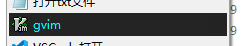

MenuZ 介绍
----------------

MenuZ 模块的最基本工作流程：

1. 鼠标移动至需要选择的内容，可以是资源管理器中的某个文件，也可以是一段文字。

2. 按下快捷键（默认是 *Alt + Q*)

3. 菜单根据选中的内容进行处理，显示出匹配 "选中内容" 的菜单项

4. 点击执行菜单预定义的功能。

使用 MenuZ 模块需要进行菜单项的定义，包括菜单名称和样式，菜单项在什么条件下出现，以及执行哪些功能。

为了方便定义菜单项，MenuZ 模块的定义语法沿用了 Candy 的一些语法，所以你会看到类似于这样的标签:

.. code-block:: ahk

    {file:path}

    {ext:= txt, ini, json}

不要担心，这个语法并不难，因为经常用的标签就几个。当你需要复杂场景的时候，再查询可用标签即可。

.. tip::

    QuickZ 鼓励你无论是使用 VIMD 模块还是 MenuZ 模块，在遇到某个重复操作时并大量花费时间的情况下进行配置，而不是设想场景然后配置用不到的功能。

.. attention::

    接下来你需要了解：

    1. MenuZ能够选中哪些内容？

    2. 怎样定义一个菜单？

    3. 怎样让菜单根据选择的内容来决定是否显示？

    4. 菜单点击后执行什么？

选中内容
----------------

MenuZ 模块会将选中的内容保存一个环境信息( env )

这个环境信息 ( env ) 保存的内容如下：

鼠标焦点选中了内容，MenuZ 会自动将选中的内容进行分析

文件
^^^^^

标记当前选中了文件，然后进一步分析出文件全路径、文件名、文件后缀名等。

.. note:: 

    选中文件示例：

    .. code-block:: ahk 

        C:\\dir\\quickz.txt

    MenuZ 模块的处理如下：

    .. code-block:: ahk

        env.isFile          标记是否选中文件       True
        env.isFileMulti     标记是否选中多个文件   False
        env.file.path       文件路径              C:\dir\quickz.txt
        env.file.name       文件名                quickz.txt
        env.file.dir        文件目录              C:\dir
        env.file.ext        文件后缀              txt
        env.file.namenoext  无文件后缀的文件名     quickz
        env.file.drive      驱动器名              C

文本
^^^^^

标记当前选中了文本，并获取纯文本内容。

.. note::

    选择示例:

    .. code-block::  ahk

        abcdefg 中文

    MenuZ 模块的处理如下：

    .. code-block::  ahk

        env.isText          标记当前选中是文本类型        True
        env.text            当前选中的文本                abcdefg 中文

窗口
^^^^^^

无论是否选中内容，窗口信息都会被获取。

.. note:: 

    当 Notepad 记事本程序上获取窗口信息

    MenuZ 模块的处理如下：

    .. code-block:: ahk

        env.isWin            标记当前选中文本             True
        env.x                当前鼠标的 x 座标            324    
        env.y                当前鼠标的 y 座标            230
        env.winHwnd          当前的 Hwnd 值              0xf3d38028
        env.winClass         当前的 Class 值,区分大小写   Notepad
        env.winExe           当前的程序名                notepad.exe
        env.winExeFullPath   完整程序名                  C:\windows\notepad.exe
        env.winControl       当前控件名                  Edit1
        env.winTitle         当前程序标题名              无标题 - 记事本

菜单项
----------------

MenuZ 模块的菜单项支持完整的自定义，拥有多个选项满足个性化要求。

.. tip::

    所有的菜单项的选项都支持变量

名称 (name)
^^^^^^^^^^^

菜单的名称，名称无特殊限制。 当名称为空时，菜单项会显示为分割线。

如需要指定菜单项的快捷键，请通过添加 ``&`` 字符实现。例如:

``&Notepad`` 显示出的结果是 ``Notepad`` ，并支持 ``N`` 键激活

如果需要对齐菜单名称，请通过添加 ``>>`` 实现，例如：

``记事本>>(&N)`` 显示出的名称为 ``记事本              (&N)``

图标 (icon)
^^^^^^^^^^^

为了方便标识菜单，菜单项支持添加图标展示。

图标值由图标资源文件 + 图标编号组成，图标编号需要添加，写法如下：

``C:\windows\notepad.exe:0``

图标资源文件支持多种格式，包括：

``.ico``  ``.exe`` ``.dll`` ``.icl``

例如指定变量 ``cmd`` 为 ``C:\windows\system32\cmd.exe`` 

可以这样使用图标值: ``%cmd%:0``

文字颜色 (tcolor)
^^^^^^^^^^^^^^^^^

菜单项可以设置文字颜色，颜色值为6位十六进制RGB值。

例如： ``0xffff00``

颜色代码可以查询 `这里 <colorcode.html>`_ 

背景颜色 (bgcolor)
^^^^^^^^^^^^^^^^^

菜单项背景颜色，和文字颜色的设置一样，这里不多描述。

筛选器 (filter)
^^^^^^^^^^^^^^^^^

默认所有定义的菜单在任何情况下都会显示出来，这样当然不够方便快捷。所以你需要了解筛选器的知识，还记得我们说过的环境信息 ``env`` 吗？我们需要定义筛选器，MenuZ 模块会根据定义的条件来判断是否满足当前的环境信息，最终决定是否显示对应的菜单项。

定义一个筛选器, 声明仅当选中的文件后缀名为 ``ahk``，``txt``，``ini`` 的文件才显示，你可以这样表示：

.. code-block:: ahk

    {ext:= ahk, txt, ini}

MenuZ 内置10个筛选器，除了 ``{ext}`` 之外，常用的还有 ``{only}``, ``{text}``, ``{filename}``,  ``{winexe}``, ``{pos}`` 等。

这是详细列表： `筛选器列表 <filter.html>`_

上述的例子中，你能看到 ``ext:`` 后面还带个了 ``=`` 号吗？ 除了 ``{pos}`` 外，其它筛选器都支持 3 种操作符

``=``: 等于。

``!``: 不等于。

``@``: 正则式匹配。

操作符后的条件都是 ``与`` 连接的。

.. code-block:: ahk
    
    {ext:= ahk, txt, ini}

这个例子里表示: "文件后缀包括 ahk 或者 txt 或者 ini"

那么 ``{pos}`` 呢？ ``{pos}`` 的操作符只有两个，``<`` 和 ``>``， 选项只有 ``x`` 和 ``y``。

.. code-block:: ahk

    {pos: x>800, y>600}

这个例子表示鼠标所在的 x 坐标大于 800， y 坐标大于 600，用这个筛选器就可以菜单项仅在鼠标位于屏幕右下方的时候显示。

运行程序 (exec)
^^^^^^^^^^^^^^^^^
运行程序一般填写可执行文件的完整路径。

如 ``c:\windows\notepad.exe``

运行程序可以附带 函数指令 : 类似 ``<sendtext>`` 这种使用一对 ``<>`` 括起来的，表示 QuickZ 加载的函数。

多个函数指令与可执行文件可以混合使用： ``<opencmd> <sendtext> C:\windows\notepad.exe``

所有的函数指令都会在执行后替换成函数返回的值。

运行参数 (param)
^^^^^^^^^^^^^^^^^
运行参数经常需要与标签一起使用。例如使用 gvim ，以 -d 参数打开某个文件，你可这样编写参数

.. code-block:: ahk

    -d "{file:path}" 

    "{file:path}" 会被替换成当前选中的文件完整路径

    "{text}" 替换当前选中的文本

你还需要了解更多的标签，请查看 `标签列表 <tag.html>`_

工作目录 (workdir)
^^^^^^^^^^^^^^^^^
工作目录用于运行程序时的指定目录，一般情况下留空即可。

工作目录同样支持标签和变量

子菜单 (sub)
^^^^^^^^^^^^^^^^^
菜单项可以做为另一个菜单项的子菜单，层次无限制，但是建议不要超过3个层级。
